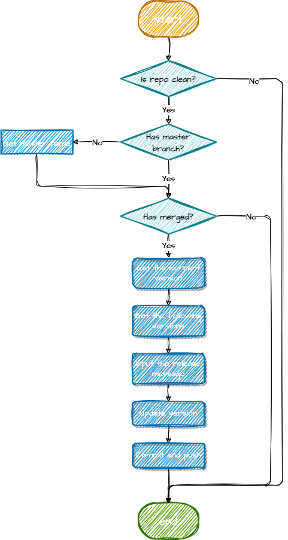

# 🎡 Truck-CLI

Truck-CLI is an indispensable tool that streamlines the front-end CI/CD workflow.

## Installation 🛠

```
npm install truck-cli -g

# OR

yarn global add truck-cli
```

## Usage 👨‍💻

You are supposed to have a `package.json` file in your project. Please note that the `version` field in your `package.json` file must be a valid semantic version. Execute the following command in your project root directory to update the version of your project. And you can use the `config` command to satisfy different use cases.

```
Usage: truck-cli [options] [command]

A command-line tool for streamlining the front-end CI/CD workflow.

Options:
  -V, --version     output the version number
  -h, --help        display help for command

Commands:
  release           Update the version of the current repository.
  config [options]  Set the runtime config of truck-cli.
  lang [options]    Set the language of the current repository.
  help [command]    display help for command
```

## Workflow 🧫

### release 🎉



### set-repo-config 🔧


### set-lang 🌎


<!-- ### create-template 📄 // TODO -->

<!--  -->

<!-- ### support-ci/cd/yml 🚗 // TODO -->

<!--  -->

<!-- ```
┌  Welcome to TK!
│
◇  Where should TK initialize the config?
│  ./docs
│
◇  Site title:
│  My Awesome Project
│
◇  Site description:
│  A TK Site
│
◆  Theme:
│  ● Default Theme (Out of the box, good-looking docs)
│  ○ Default Theme + Customization
│  ○ Custom Theme
|
└  End
``` -->