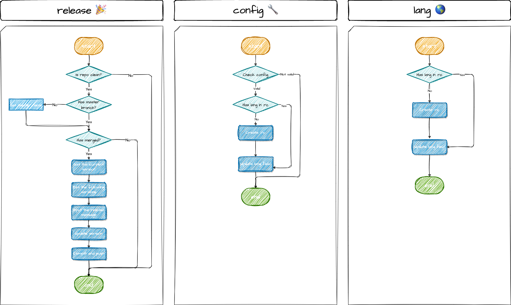

<p align="center">
  
</p>
<p align="center">An indispensable tool that streamlines the front-end CI/CD workflow.</p>
<p align="center">
  <a href="https://www.npmjs.com/package/truck-cli" target="_blank">
    
  </a>
  <a href="https://www.npmjs.com/package/truck-cli" target="_blank">
    
  </a>
  <a href="https://www.npmjs.com/package/truck-cli" target="_blank">
    
  </a>
  <a href="https://github.com/yingjieweb/truck-cli/actions/workflows/test.yml" target="_blank">
    
  </a>
  <a href="https://codecov.io/gh/yingjieweb/truck-cli" target="_blank"> 
     
  </a>
</p>

<!-- ## Why use Truck-CLI? 🤔 -->

## Installation 🛠

```
npm install truck-cli -g

# OR

yarn global add truck-cli
```

## Usage 👨‍💻

```
Usage: truck-cli [options] [command]

A command-line tool for streamlining the front-end CI/CD workflow.

Options:
  -V, --version     output the version number
  -h, --help        display help for command

Commands:
  release           Update the version of the current repository.
  config [options]  Set the runtime config of truck-cli.
  lang [options]    Set the language of the current repository.
  help [command]    display help for command.
```

🚩 **release**: You are supposed to have a `package.json` file in your project. Please note that the `version` field in your `package.json` file must be a valid semantic version. Execute the `tk release` in your project root directory to update the version of your project. And you can use the `config` command to satisfy different use cases.

🚩 **config**: This command is used to set the runtime config of truck-cli. When you set a config, the config will be saved in the `.truckrc` file. You can set the following configs: `global`、`project`、`repoName`、`checkMerge` and `targetBranchName`. Be careful some configs are not compatible with each other. You will find it in the command execute process.

🚩 **lang**: This command is used to set the language of the current repository. Includes inquirer prompt and command messages. Current support languages are: `en`、`zh-CN`.

## Workflow 🧫



## License

Nest is [MIT licensed](LICENSE).
