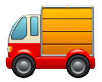
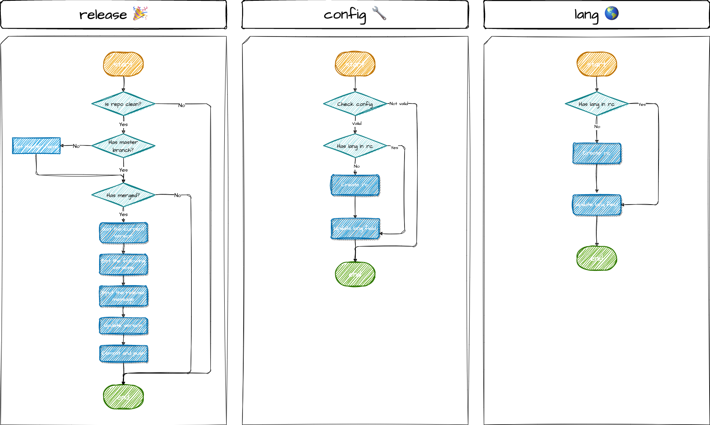

<p align="center">
  
</p>
<p align="center">一款精简前端 CI/CD 工作流程不可或缺的工具。</p>
<p align="center">
  <a href="https://www.npmjs.com/package/truck-cli" target="_blank">
    
  </a>
  <a href="https://www.npmjs.com/package/truck-cli" target="_blank">
    
  </a>
  <a href="https://www.npmjs.com/package/truck-cli" target="_blank">
    
  </a>
  <a href="https://github.com/yingjieweb/truck-cli/actions/workflows/test.yml" target="_blank">
    
  </a>
  <a href="https://codecov.io/gh/yingjieweb/truck-cli" target="_blank"> 
     
  </a>
</p>

<!-- ## 为什么使用 Truck-CLI？ 🤔 -->

## 前提 🚨

确保你的 Node.js 版本大于等于 18。

## 安装 🛠

```
npm install truck-cli -g

# 或者

yarn global add truck-cli
```

## 使用 👨‍💻

```
使用方式: tk [选项] [命令]

一款精简前端 CI/CD 工作流程不可或缺的工具。

选项:
  -V, --version     显示版本号
  -l, --lang <lang> 指定当前工具的语言 (en or zh)
  -h, --help        显示命令的帮助信息

命令:
  checkupdate       检查 truck-cli 是否有新版本
  release           更新当前仓库的版本
  config [选项]      设置 truck-cli 的运行配置
  help [命令]        显示命令的帮助信息
```

🚩 **checkupdate**: 这个命令用于检查 Truck-CLI 的版本。当你执行这个命令时，Truck-CLI 将检查自身的最新版本，并显示结果。如果 Truck-CLI 的版本不是最新的，它会引导你更新 Truck-CLI。

🚩 **release**: 你需要在项目中拥有一个 `package.json` 文件。请注意，`package.json` 文件中的 `version` 字段必须是一个有效的语义化版本号。在项目根目录执行 `tk release` 命令来更新项目的版本。你可以使用 `config` 命令来满足不同的用例。

🚩 **config**: 这个命令用于设置 Truck-CLI 的运行配置。当你设置配置时，配置将被保存在 `.truckrc` 文件中。你可以设置以下配置项：`checkMerge` 和 `targetBranch`。这些配置项将被用于控制 Truck-CLI 的行为。

🚩 **lang**: 这个命令用于设置当前仓库的语言。包括询问提示和命令消息。当前支持的语言有：`en`、`zh-CN`。

## 工作流程 🧫



## 许可证

Truck-CLI is [MIT 许可证](LICENSE).
